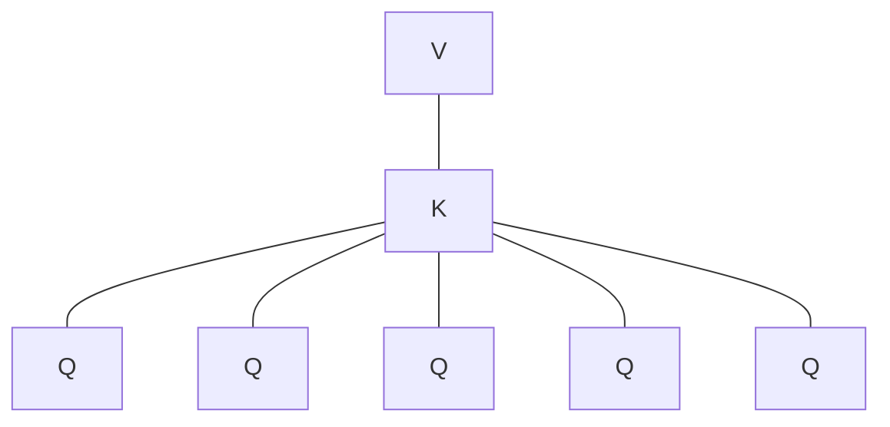

# 前言

这个除了考察`Qwen14B`的参数细节之外，还有一个很重点的：`Qwen-14B`并不是传统的`MHA`中的`QKV`结构，而是`GQA`结构。

<!-- more -->

# 有多少个头

参考[【免费下载】 深入探索Qwen2.5-14B模型的参数设置](https://blog.csdn.net/gitblog_02260/article/details/144844761)，`Qwen2.5-14B`的参数设置如下：

|名称|参数|
|:-:|:-:|
|参数数量|$14.7B$（含$13.1B$非嵌入参数）|
|层数|$48$|
|注意力头|$40$个查询、$8$个键值头|
|上下文长度|$131072$|
|多语言支持|$29$|

其中，$40$个查询表示`Q`头，$8$个键值头表示$8$对`KV`的头。因此，可以推算出，一共是$\frac{40}{8}=5$个`Q`头共用一对`KV`头。就像这样：

# GQA过程参考

首先，当然是把文字输入进去。对于用户的输入文本`input_text`，首先经过`Embedding`，将`input_text`转变为`input_embedding`和`position_embedding`。这也就是大模型的第一层隐状态输出$X$。

第二层开始，输入都是上一层的隐状态$X$。在此基础上，使用大模型构建的三个权重矩阵$W_Q$、$W_K$和$W_V$，以$X$作为输入，计算出`Q`、`K`和`V`，然后得到注意力$\text{Attention(Q,K,V)}$为$\text{Softmax}(\frac{QK^\top}{\sqrt{d_k}})V$。

其中，参考上述参数，可以得到，`Q`矩阵的尺寸为$(B,T,40,d_k)$，这里$B$表示批量大小，$T$表示输入文本的长度，$d_k$表示注意力头维度。同理，`K`和`V`尺寸相同，为$(B,T,8,d_k)$。

接下来，对于一共$40$个`Q`头，可以计算一共$40$个输出：

$$O_i=\text{Softmax}(\frac{Q_iK_j^\top}{\sqrt{d_k}})V_j\tag{1}$$

其中，$i$表示第$i$个`Q`头，$j$表示第$j$对`KV`头，且满足$i,j=1,2,...$、$j=\lceil\frac{i}{8}\rceil$。

这一共$40$个$O_i$，最终通过线性输出层，得到最终输出为

$$O=W_O\times\begin{bmatrix}O_1\\O_2\\...\\O_{40}\end{bmatrix}\tag{2}$$

# 为什么使用这个方案？

我们知道，占据显存的主要是中间的`KVCache`。

在`MHA`中，对于$40$个`Q`头，就有$40$对`KV`头，而如果采用`GQA`这种几个`Q`头共用同一个`KV`头，就相当于只需要存储$8$对`KV`头，显存占用降低了$\frac{40-8}{40}=80\%$。