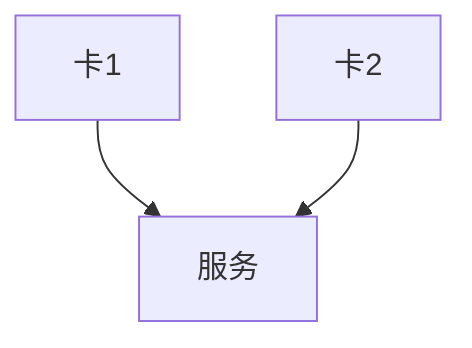

# 前言

这道题偏原理，不过为了让讲的东西不这么枯燥，我们在原理中穿插一点具体技术。

<!-- more -->

# 概览

本质上，多卡并行的出现，就是考虑到数据与中断反复通过`CPU`进行调度的时候，会产生高频的延迟。更不用说大批量数据进去计算的时候，总线有速度上线，`CPU`有取数上限，内存有访问上限，各种各样的`IO`限制了瓶颈。因此，多卡并行现阶段主要是通过`RDMA`协议，直接走主板上的`PCI-E`总线进行数据传输，从而避免了`CPU`的调度。

> 那我们就从从宇宙大爆炸开始……

当然，只是开个玩笑。我们先从很远很远的地方开始，然后再慢慢递进。毕竟，多卡并行并不是几个技术栈就能讲明白的。

# 算力平台部署

算力平台部署就是一个面向用户的场景，我们可能有很多张卡，甚至一张卡通过`MIG`去分成了不同的实例，整卡或者实例之间采用一些技术手段进行通信，才是一个完整的算力平台。

我们先不考虑什么`GPU Stack`、`NVIDIA DevOps`等成套的解决方案，我们直接从零开始。

首先，我们反正就是拿到了两张`A100`，然后可以开机并进入系统，并且`nvidia-smi`是正常列出两台设备的。到这一步没什么问题。

接下来，我们要考虑的，首先就是如何让用户通过`Web`端申请到一部分算力，并对外提供服务。

简单地说，就是像这样：



<center>图1 基本思路</center>

# docker

至于什么`docker`原理啊使用啊什么的这里就全跳过了。

总之就是，你看到上面图1的内容，就会想起`docker`里面的`gpus`参数。我们在`nvidia-docker`中配置了`gpus`参数，那么`docker`就会将`GPU`设备映射到容器中，然后`docker`会调用`nvidia-container-runtime`，将`GPU`设备映射到`CUDA`中。

相当于，对于任何一台机器，我们都是用`nvidia-docker`强行讲所有可用设备虚拟化了。虚拟化了之后，我们后续的服务也就脱离开了硬件本身的各种调度，直接使用硬件驱动所提供的服务。

# MIG

当然，这样做肯定是有缺陷的。尤其是，部分人可能用过$3090$、$4090$等消费级显卡配置服务。使用过的人明显能够感觉到，这样用虚拟化配置的服务，一次只能进去一个人。哪怕是`docker`将一张卡虚拟化成了三个服务，每次都指向了同一个卡，显存也就直接爆炸，死机也就很经常了。

于是呢，`MIG`就是一个解决方案，将一张卡区分出多个实例，然后再想办法虚拟化。

> P.S.：消费级显卡是没有这种技术的，只有专业计算卡才有。

本质上来说，也就是让`docker`虚拟化的时候，避免了一次占用了整张卡，显存存数据的时候也就彻底实现了一张卡分配给多个人用。

那么，怎么用呢？

首先，我们先启用显卡的`MIG`功能：

```bash
$ sudo nvidia-smi -i 0 -mig 1
```

这句话就是启用`GPU:0`的`MIG`功能（配置`MIG`为`enable`，标志位是$1$）。

然后，我们再分解（这里直接就将$40$G的`A100`分解为多个$5$G的实例）：

```bash
$ sudo nvidia-smi mig -i 0 -cgi 19,19,19,19,19,19,19 -C
```

这里的参数稍微多一些，大概是这样：

|参数|全写行为|含义|
|:-:|:-:|:-:|
|`mig`|`MIG`子命令|表示要操作`MIG`相关配置|
|`-i 0`|`--id 0`|选择`GPU0`|
|`-cgi`|`--create-gpu-instance`|创建`GPU Instance`组合|
|`19,19,19,19,19,19,19`|配置`profile IDs`|$19$代表`1g.5gb`的`GI Profile`|
|`-C`|`--compute-instance`|在创建 GI 后，**自动为每个 GI 创建 CI**|

聪明的你肯定发现了：为什么拆`5G`的实例的时候，只能写$7$个$19$，而不是$40\div5=8$个呢？

这就涉及到硬件底层了。因为`A100`只有$7$个`GPC`，也就是`Graphics Processing Cluster`，每个`GPC`就是一个处理单元，所以只能拆成$7$个$5G$的实例，剩下的那个没有位置了。

拆完之后，我们就可以查看一下具体的实例`UUID`了：

```bash
$ nvidia-smi -L
```

他将输出这么些玩意儿：

```bash
GPU 0: A100 (UUID: GPU-XXXXXX)
  MIG 1g.5gb Device 0: (UUID: MIG-GPU-AAAA/1/0)
  MIG 1g.5gb Device 1: (UUID: MIG-GPU-BBBB/2/0)
```

这些内容都将暴露在`/proc/driver/nvidia/mig/*`里面。

# k8s

首先，通过`nvidia-device-plugin`，就可以去上面这个暴露的接口找到硬件信息，然后返回`MIG`对象。

拿到对象后，继续在对象基础上使用`k8s API server`，注册资源类型。在注册的时候，主要依赖`nvidia-device-plugin`会主动汇集并上报资源信息，这样核心的`kubelet`才能够感知到，因为它本身无法解析`GPU`资源信息，而只能够识别`CPU`、`Memory`这类基础资源。只有`nvidia-device-plugin`上报后，`GPU`资源信息才能够转换成`k8s`资源对象。

注册之后，再经过`GPU Feature Discovery`，读取`node GPU`拓扑，并打上标签。到这一步，就可以直接用`k8s`的命令查看节点信息了。

最后，通过`GPU Operator`，将`MIG`对象转换成`GPU Instance`对象，并返回给`k8s`。

到这里，`k8s`才有显卡的调度权限。

好了，到这里，多卡并行在应用层的思路就介绍完了。接下来就是底层数据了。

# NCCL

`NCCL`是`NVIDIA`的`GPU`通信库，`NCCL`提供了`GPU`通信的接口，并且提供了`GPU`通信的实现。