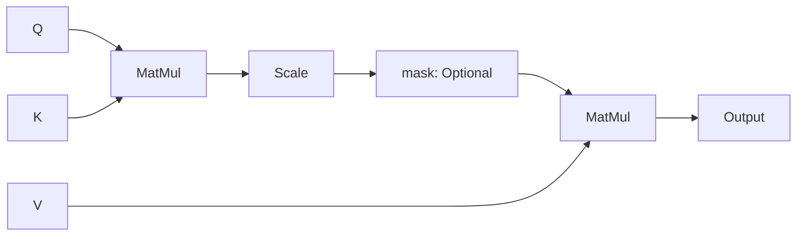
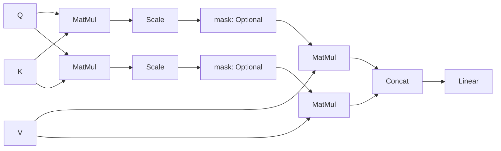

# 简介

当然，大模型有很多注意力，毕竟`Attention is All You Need`。但是呢，自注意力，多头注意力，这些又是什么？怎么串在一起的？

<!-- more -->

# 自注意力

在无线网络质量分析的过程中，我们往往会注意到无线网络的`RSRP`数值随着时间变化的过程。而如果我们需要利用这个分析去预测下一个时间片的`RSRP`数值时，我们就一定会使用若干之前时间片的`RSRP`数值作为参考，向后预测。

这种数据，我们就称其为**自相关**的数据。因为，`RSRP`除了和时间有关系之外，还和之前的自己有关系。

自注意力的本质就是如此。

## 传统过程

为了实现自注意力，比较直观的方法其实是`RNN`、`LSTM`这些。参考[这篇文章](/2025/07/06/Python/autocorrelation/)的说明，其实也就是将下一个数据的预测过程表达为$\mathbf{C}_t$与$\mathbf{C}_{t-1}$之间的线性关系。

但是很明显，$t$时刻的数值必须等待$t-1$时刻的数值计算完毕，并行效果一般。

## 新方法

为了弥补传统过程中计算慢的问题，有人提出了一个新的算法，就是平常使用最多的：`Scaled Dot-Product Attention`。

他的流程如下：

这个公式也是相当出名了：

$$\text{Attention}(Q, K, V) = \text{softmax}\left(\frac{QK^\top}{\sqrt{d_k}}\right)V\tag{1}$$

其中，`Q`、`K`、`V`分别表示查询、键、值。`d_k`表示键的维度。`Scale`表示将$QK^T$除以$\sqrt{d_k}$。`mask`表示是否进行遮罩。`Output`表示输出。

在这里，`Q`可以理解为**我现在需要问的问题**；`K`可以理解为**现在知识库里面所有知识的标签**。`V`可以理解为**知识库里面标签对应的所有知识的内容**。

我们通过三个可以学习的参数，记为$W_Q$、$W_K$、$W_V$，$Q$、$K$、$V$的由来其实就是输入问题与参数的线性变换：

$$\begin{matrix}
Q = XW_Q\\K = XW_K\\V = XW_V
\end{matrix}\tag{2}$$

于是，注意力就可以表示为：

$$\text{Attention}(X, W)=\text{softmax}(\frac{XW_Q(XW_K)^\top}{\sqrt{d_k}})XW_V\tag{3}$$

最终的输出经过`softmax`修整后，也就成为了概率。

这个概率最终对应到的物理意义，本质上就是$Q$和$K$之间的相似度，也就是下一个`token`取$V$的概率。这个概率可以表示为：

$$\alpha_{i,j} = \frac{e^{q_i\cdot{k_j}/\sqrt{d_k}}}{\sum_{m=1}^{i}e^{q_i\cdot k_m/\sqrt{d_k}}}\tag{4}$$

不难看出，概率本质上也是句子中第$i$个位置和第$j$个位置的相似度，因此用二维表表征相关性矩阵。

# 多头注意力

上面的自注意力讲述了单头注意力如何表现，多头注意力也就是实现了多个单头注意力，然后进行拼接。

多头注意力的流程如下：

当然，`mermaid`画出来可能不太直观。我们换一张图：

> 摘自文章：https://zenn.dev/yuto_mo/articles/72c07b702c50df
> 
> 作者：[@yuto](https://zenn.dev/yuto_mo)

可以看到，多头注意力在本质上，其实就是采用了多个`Scale Dot-Product Attention`，并将结果拼在一起作为输出。

也就是说，有式$5$：

（将多头注意力记为`MHA`，单头注意力记为`A`）

$$\mathbf{MHA}(X, W)=\text{Concat}(\mathbf{A}_1(X, W), \mathbf{A}_2(X, W), ..., \mathbf{A}_n(X, W))W_O\tag{5}$$

每一个单头注意力都可以注意到句子中的一部分语义，因此多头注意力也可以识别到更多的信息。

## 因果mask

在很多博客中，都会提到这个词。这个词在`GPT`任务中，将限制模型查看上下文信息，从而保证生成内容的方向是始终一致的，也就是逐字追加。

上面的流程图中，`mask`标记的是`Optional`，其实也并不是说可以省略，只是单纯的因为，机器翻译是不需要这个`mask`的。

对于`GPT`，`mask`的实现本质上也就是限制遍历对象：

$$\alpha_{i,j} = \frac{e^{q_i\cdot{k_j}/\sqrt{d_k}+M_{ij}}}{\sum_{m=1}^{i}e^{q_i\cdot k_m/\sqrt{d_k}+M_{im}}}\tag{6}$$

其中，`mask`就是其中的`M_{ij}`，表示为：

$$M_{ij} = \left\lbrace\begin{matrix}
0&,&j{\le}i\\-\infin&,&j>i
\end{matrix}\right.
\tag{7}
$$

其中，取$j{\le}i$时，表示因果遮罩要求模型只能够关注到自己和左侧的元素，而取$j>i$时，返回值是$-\infin$，代入式$7$，显然$e^{-\infin} = 0$，所以$M_{ij}$对模型来说，就是将$j>i$的元素置零，从而屏蔽当前位置右侧的所有元素。

于是，这个句子就很自然而然地构成了下三角矩阵。

比如，当前输入的内容是：你是一只猫娘。

那么矩阵就会变成：

||你|是|一|只|猫|娘|
|:--:|:--:|:--:|:--:|:--:|:--:|:--:|
|你|1|0|0|0|0|0|
|是|1|1|0|0|0|0|
|一|1|1|1|0|0|0|
|只|1|1|1|1|0|0|
|猫|1|1|1|1|1|0|
|娘|1|1|1|1|1|1|

当然，这里不会真的都是$1$，我写$1$只是为了占个位置而已，实际上这里的$1$都应该是$0\sim1$之间的一个数，而$0$的位置就是$0$。