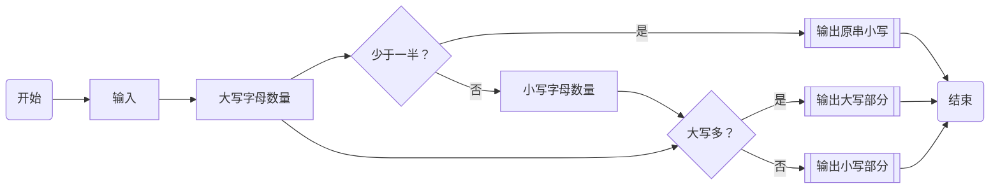

# 前言

智能体规划，也称`agent planning`，是指智能体在某个状态下，如何进行规划，如何进行选择，如何进行执行，如何进行反馈，如何进行更新。

但是呢，如果直接从`LangGraph`开始，可能对这个概念并没有特别清楚，我们先一步步来。

<!-- more -->

# 智能体规划

规划方法其实有很多种，这里就介绍一下相对来说比较复杂的一种：`P&E`，也就是`Planning and Execution`。

该方法本质上也是构建一个有向、无环的工作流结构（也称`DAG`），每个节点即为大模型智能体的一次处理过程，期间输出一个`JSON`，要求有着严格的输出格式。

其中，格式虽然可以自定义，但是本质上包含：

1. `id`：任务索引，用于维持任务的唯一性；
2. `name`：任务名称，用于描述任务的内容；
3. `dependes_on`：任务依赖，用于描述当前任务依赖的节点；
4. `output`：任务输出，用于描述当前任务输出的内容；
5. `accept`：任务接收条件，用于检测最终输出结果是否满足要求；

如果你还希望在每个节点给出更神奇的操作，可以继续添加一个`tool`属性。

当然，无论是`accept`还是`tool`，可选是其中一个特点，另一个特点就是可以直接使用本地脚本或者`lambda`方法，可以大幅提升自定义程度。

# 一个流程简单但也麻烦的一个例子

我们用一个小例子尝试一下。

这个例子流程上没多少节点，但是比较麻烦：

1) 第一步：
   
   检测所有大写字母

   若大写字母数量低于一半 → 输出原串全小写并结束；

   若大写字母多于(或等于)一半 → 输出“进入第二步”，并进入第二步；

2) 第二步：
   
   比较【检测得到的大写串】与【找出的小写串】的长度，谁长输出谁。

用人脑智能判断当然是简单的，用`Python`脚本写起来也没有那么麻烦的。

于是，首先，我们先规定一下流程：



## 粗暴的面向过程解决方案

如果面向过程去写这个东西，会让事情变得非常简单：

```python
def detect_upper(s: str) -> str:
    up = ''.join([c for c in s if c.isupper()])
    lo = ''.join([c for c in s if c.islower()])
    return f"UP={up}|LO={lo}|UC={len(up)}|LEN={len(s)}"

def majority_check(meta: str, original: str) -> str:
    # 解析 Step 1 字符串
    parts = dict(p.split('=') for p in meta.split('|'))
    uc, ln = int(parts['UC']), int(parts['LEN'])
    if uc < ln / 2:
        return original.lower()  # 直接终止流程的最终输出
    return "进入第二步"  # 仅用于流转

def compare_and_pick(meta: str) -> str:
    parts = dict(p.split('=') for p in meta.split('|'))
    up, lo = parts['UP'], parts['LO']
    return up if len(up) > len(lo) else lo

def run_agent(s: str) -> str:
    step1 = detect_upper(s)
    decision = majority_check(step1, s)
    if decision != "进入第二步":
        return decision
    # 第二步
    return compare_and_pick(step1)

print(run_agent("LangGraph"))  # 输出: langgraph
print(run_agent("LANGgRAPH"))  # 输出: LANGRAPH
```

## P&E

如果按照`P&E`模板完成这件事的话，接下来就首先按照流程图给出`JSON`格式的`DAS`，如下：

```python
def planner(input_text: str) -> Dict[str, Any]:
    """根据输入生成固定的三步计划（包含路由规则）。"""
    plan = {
        'plan_id': uuid.uuid4().hex,
        'context': {'original': input_text},
        'steps': [
            {
                'id': 'T1',
                'name': 'DetectUpper',
                'tool': 'detect_upper',
                'args': ['original'],
                'save_as': 'meta',
                'route': {'*': 'T1D'},  # 无条件流转到判定
            },
            {
                'id': 'T1D',
                'name': 'MajorityCheck',
                'tool': 'majority_check',
                'args': ['meta', 'original'],
                'route': {  # 输出文本命中则跳转，否则按 '*' 兜底
                    '进入第二步': 'T2',
                    '*': 'END',
                },
            },
            {
                'id': 'T2',
                'name': 'CompareAndPick',
                'tool': 'compare_and_pick',
                'args': ['meta'],
                'route': {'*': 'END'},
            },
        ],
    }
    return plan
```

接下来，我们将根据这个`JSON`实现其中的逻辑，包括每个节点的`tool`，节点的`args`，以及进入节点后跳转的`route`。

整段代码放在这里：

```python
from __future__ import annotations
import uuid
from dataclasses import dataclass
from typing import Dict, List, Callable, Any

def detect_upper(original: str) -> str:
    """输出形如：UP=<大写拼接>|LO=<小写拼接>|UC=<大写数>|LEN=<总长>"""
    up = ''.join([c for c in original if c.isupper()])
    lo = ''.join([c for c in original if c.islower()])
    return f"UP={up}|LO={lo}|UC={len(up)}|LEN={len(original)}"


def majority_check(meta: str, original: str) -> str:
    """若大写占比 < 1/2 → 直接返回原串小写；否则返回“进入第二步”。"""
    parts = dict(p.split('=') for p in meta.split('|'))
    uc = int(parts['UC'])
    ln = int(parts['LEN'])
    if uc * 2 < ln:  # 严格小于一半则直接结束
        return original.lower()
    return "进入第二步"  # >= 一半进入第二步


def compare_and_pick(meta: str) -> str:
    """从 meta 中取出 UP/LO，长度谁大输出谁（并直接输出对应那段字符串）。"""
    parts = dict(p.split('=') for p in meta.split('|'))
    up, lo = parts['UP'], parts['LO']
    return up if len(up) > len(lo) else lo

TOOLS: Dict[str, Callable[..., str]] = {
    'detect_upper': detect_upper,
    'majority_check': majority_check,
    'compare_and_pick': compare_and_pick,
}

@dataclass
class Step:
    id: str
    name: str
    tool: str
    args: List[str]          # 从 ctx 里按名取参数
    route: Dict[str, str]    # 输出字符串 → 下一步ID；支持 '*' 作为兜底；'END' 表示结束

def planner(input_text: str) -> Dict[str, Any]:
    """根据输入生成固定的三步计划（包含路由规则）。"""
    plan = {
        'plan_id': uuid.uuid4().hex,
        'context': {'original': input_text},
        'steps': [
            {
                'id': 'T1',
                'name': 'DetectUpper',
                'tool': 'detect_upper',
                'args': ['original'],
                'save_as': 'meta',
                'route': {'*': 'T1D'},  # 无条件流转到判定
            },
            {
                'id': 'T1D',
                'name': 'MajorityCheck',
                'tool': 'majority_check',
                'args': ['meta', 'original'],
                'route': {  # 输出文本命中则跳转，否则按 '*' 兜底
                    '进入第二步': 'T2',
                    '*': 'END',
                },
            },
            {
                'id': 'T2',
                'name': 'CompareAndPick',
                'tool': 'compare_and_pick',
                'args': ['meta'],
                'route': {'*': 'END'},
            },
        ],
    }
    return plan

def execute(plan: Dict[str, Any], tools: Dict[str, Callable[..., str]] = TOOLS) -> Dict[str, Any]:
    steps = [Step(**s) for s in plan['steps']]
    step_index = {s.id: s for s in steps}
    ctx: Dict[str, Any] = dict(plan.get('context', {}))
    trace: List[Dict[str, Any]] = []

    cur_id = steps[0].id if steps else None
    last_output: str | None = None

    while cur_id and cur_id != 'END':
        step = step_index[cur_id]
        # 准备参数（从 ctx 取）
        args = [ctx[a] for a in step.args]
        out = tools[step.tool](*args)
        last_output = out
        if step.save_as:
            ctx[step.save_as] = out
        trace.append({'id': step.id, 'name': step.name, 'output': out})
        # 路由：精确匹配优先，其次 '*'
        if out in step.route:
            cur_id = step.route[out]
        elif '*' in step.route:
            cur_id = step.route['*']
        else:
            cur_id = 'END'

    return {'final': last_output, 'trace': trace, 'plan_id': plan['plan_id']}

if __name__ == '__main__':
    for s in [
        'LangGraph',   # 大写 2/9 -> < 一半 → 全小写
        'LANGgRAPH',   # 大写 8/9 -> >= 一半 → 第二步 → 输出较长者（UP）
        'AAaa',        # 大写 2/4 == 一半 → 第二步 → 输出较长者（LO 长度=2，UP=2 → 规则选 LO）
    ]:
        p = planner(s)
        res = execute(p)
        print(f"\nInput: {s}\nPlanID: {res['plan_id']}\nTrace:")
        for t in res['trace']:
            print(f"  - {t['id']} {t['name']}: {t['output']}")
        print('Final:', res['final'])
```

看上去虽然有点乱乱的，但是根据这样一个`JSON`，最终也能逐步完成流程。

## LangGraph

当然，这只是一种实现方法。如果每个任务都这样配置，未免也还是有点太奇怪了。如果我们要更方便地完成这个项目，其实`LangGraph`有着得天独厚的优势，那就是，它本身就自带`DAS`构建库。

所以，本质上，我们用`LangGraph`配置`add_node(node)`和`add_edge(START, node)`的时候，我们就是在用类似`P&E`的格式创建这样一张`DAS`。只不过，`LangGraph`相对而言更成体系一些，而且中间状态流转有着更强大的引擎支撑，不需要过于纠结中间过程的规范。就像这样：

```python
from __future__ import annotations
from typing import TypedDict

from langgraph.graph import StateGraph, START, END

class State(TypedDict, total=False):
    original: str  # input string
    meta: str      # "UP=..|LO=..|UC=..|LEN=.."
    last: str      # last node's string output

def _parse_meta(meta: str):
    parts = dict(p.split("=") for p in meta.split("|"))
    up = parts.get("UP", "")
    lo = parts.get("LO", "")
    uc = int(parts.get("UC", 0))
    ln = int(parts.get("LEN", 0))
    return up, lo, uc, ln

def detect_upper(state: State) -> dict:
    s = state["original"]
    up = "".join([c for c in s if c.isupper()])
    lo = "".join([c for c in s if c.islower()])
    meta = f"UP={up}|LO={lo}|UC={len(up)}|LEN={len(s)}"
    # Each step returns a single string; we also stash it in `last` for routing/visibility
    return {"meta": meta, "last": meta}

def majority_check(state: State) -> dict:
    meta = state["meta"]
    up, lo, uc, ln = _parse_meta(meta)
    # Strictly greater-than half enters step 2; equal counts as not-more-than-half
    if uc > ln / 2:
        return {"last": "进入第二步"}
    else:
        return {"last": state["original"].lower()}

def compare_and_pick(state: State) -> dict:
    meta = state["meta"]
    up, lo, uc, ln = _parse_meta(meta)
    out = up if len(up) > len(lo) else lo
    return {"last": out}

builder = StateGraph(State)

builder.add_node("T1_detect_upper", detect_upper)
builder.add_node("T1D_majority_check", majority_check)
builder.add_node("T2_compare_and_pick", compare_and_pick)

# Entry → T1 → T1D
builder.add_edge(START, "T1_detect_upper")
builder.add_edge("T1_detect_upper", "T1D_majority_check")

# Conditional routing: if last == "进入第二步" → T2; else END

def route_after_T1D(state: State):
    return "T2_compare_and_pick" if state.get("last") == "进入第二步" else END

builder.add_conditional_edges("T1D_majority_check", route_after_T1D)

# T2 terminates
builder.add_edge("T2_compare_and_pick", END)

# Compile to a Runnable
app = builder.compile()

if __name__ == "__main__":
    tests = [
        "LangGraph",   # 2/9 uppers -> end with lowercase
        "LANGgRAPH",   # 8/9 uppers -> go to step 2 -> choose UP
        "AAaa",        # 2/4 == half -> treated as end (lowercase)
    ]

    for s in tests:
        print("\nInput:", s)
        # Invoke with an initial state containing `original`
        final_state = app.invoke({"original": s})
        print("Final output:", final_state.get("last"))

        # Stream step updates (optional, helpful for debugging)
        print("Trace:")
        for event in app.stream({"original": s}, stream_mode="updates"):
            # event is a dict mapping node_name -> partial state updates
            print("  ", event)
```

总的来说，代码量差距不大，只是`LangGraph`有引擎支撑，`P&E`没有罢了。